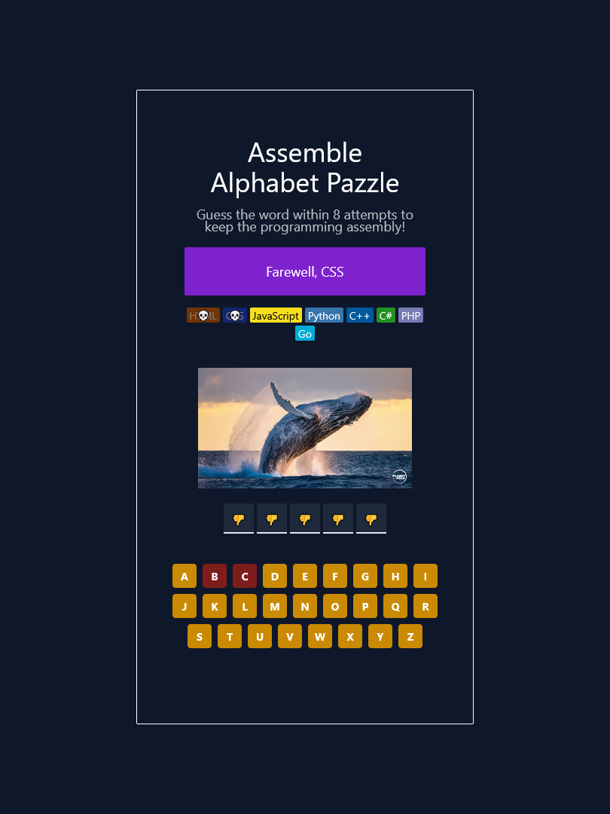

# 🚴 Alphabet Puzzle Game

The **Alphabet Puzzle Game** is a React-based web application that challenges users to solve puzzles by arranging scrambled letters into meaningful words. Designed with clean UI/UX for the kids.


---

## 🖼️ Template Preview

[Play The Game Now](https://Mdyeachen.github.io/alphabet-pazzle/)

<p align="center">
  
</p>


---

## ✨ Key Features

- 🧩 Interactive Letter Puzzles
- 🎉 Visual Rewards
- 📱 Responsive Design
- 🎨 Themed Word Categories
- ⚡ Fast Performance
- 🚀 Easy Deployment
- 🎮 Progressive Difficulty
- 🔄 Replayability
- 🛠️ Developer-Friendly

---

## ✨ Upcoming Features (Roadmap)

- Score tracking (localStorage)
- Multiplayer mode (Firebase)
- Voice hints (Web Speech API)

---

## ⚙️ Tech Stack

- **HTML5**, **CSS3**, **Tailwind CSS**, **scss**
- **React**, **Vite**
- **JavaScript (ES6+)**
- **React Icons**, **react-confetti**
- **Responsive & Accessible Design**

---

## 💡 Creadit 

- [Bootstrap v5.2.3](https://getbootstrap.com/)
- [Fontawesome 6.2.1](https://fontawesome.com)
- [Hover 2.3.2](http://ianlunn.github.io/Hover/)
- [Owl Carousel v2.3.4](https://github.com/OwlCarousel2/OwlCarousel2/blob/master/LICENSE)
- [jquery-circle-progres v1.2.2](http://kottenator.github.io/jquery-circle-progress/)
- [model](http://github.com/kylefox/jquery-modal)
- [normalize v2.8.3](http://github.com/necolas/normalize.css)
- [isotop](https://isotope.metafizzy.co/)
- [jQuery v3.6.3](https://jquery.com/download/)
- [Modernizr v2.8.3](www.modernizr.com/license/)


---


---

## 📁 Folder Structure

```bash
.
├── .gitignore
├── eslint.config.js
├── index.html
├── package-lock.json
├── package.json
├── postcss.config.js
├── README.md
├── screenshort.png
├── tailwind.config.js
├── vite.config.js
├── preview
│   ├── alphabet-pazzle.png
│   └── hangman.png
├── public
│   └── hangman.png
└── src
    ├── App.jsx
    ├── global.css
    ├── main.jsx
    ├── assets
    │   └── react.svg
    ├── component
    │   ├── game.jsx
    │   └── util.js
    └── data
        ├── animals.json
        └── language.json


```

---

## 👨‍💻 Developed by Yeachen Abir

I am a passionate **Full-Stack Developer** with a strong focus on **custom website development**, **on-page SEO**, and **digital marketing** strategies. My mission is to craft web solutions that **look stunning**, **perform fast**, and **rank well** on search engines.

### 🌟 CMS Expertise:
- Shopify | BigCommerce | WordPress | Wix  
- Custom CMS with React.js & Next.js  
- eBay Store Design & Optimization  
- Walmart Marketplace Product Optimization  

### 💻 Technical Skills:
- **Frontend**: JavaScript, React.js, HTML, CSS, SCSS, Tailwind CSS, Bootstrap  
- **Backend**: Node.js, Express.js  
- **Database**: MongoDB  
- **Version Control**: Git & GitHub  

### 📈 SEO & Digital Marketing:
- Keyword Research & Meta Optimization  
- On-Page SEO & Content Enhancement  
- Technical SEO: Speed, Mobile, Schema  
- Google Analytics & Search Console  

### 🔗 Let’s Connect!
- 💼 [LinkedIn](https://www.linkedin.com/in/yeachen-abir/)  
- 📘 [Facebook Profile](https://www.facebook.com/yeachen.abir) | [Facebook Page](https://www.facebook.com/profile.php?id=61574159927866)  
- 🐦 [Twitter / X](https://x.com/YeachenA)  
- 📸 [Instagram](https://www.instagram.com/yeachenabir/)  
- 📌 [Pinterest](https://www.pinterest.com/yeachenabir/)  
- 📬 Email: [yeachenabir@gmail.com](mailto:yeachenabir@gmail.com)

---

**#yeachen #abir #webdeveloper #shopify #wordpress #ecommerce #custom_website #react_developer #next_developer #fontend_developer #full_stack_developer #pazzelgame** 

---